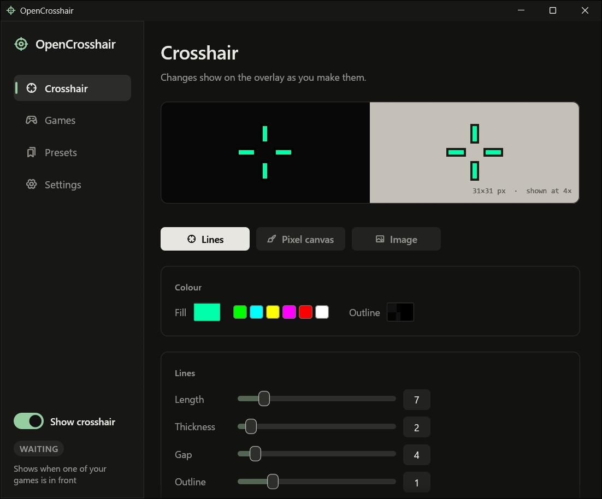
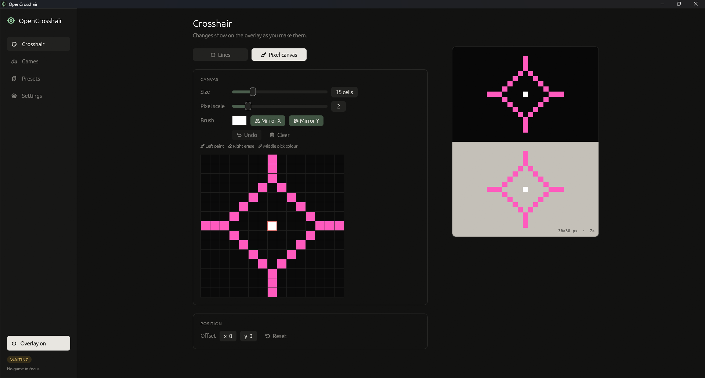
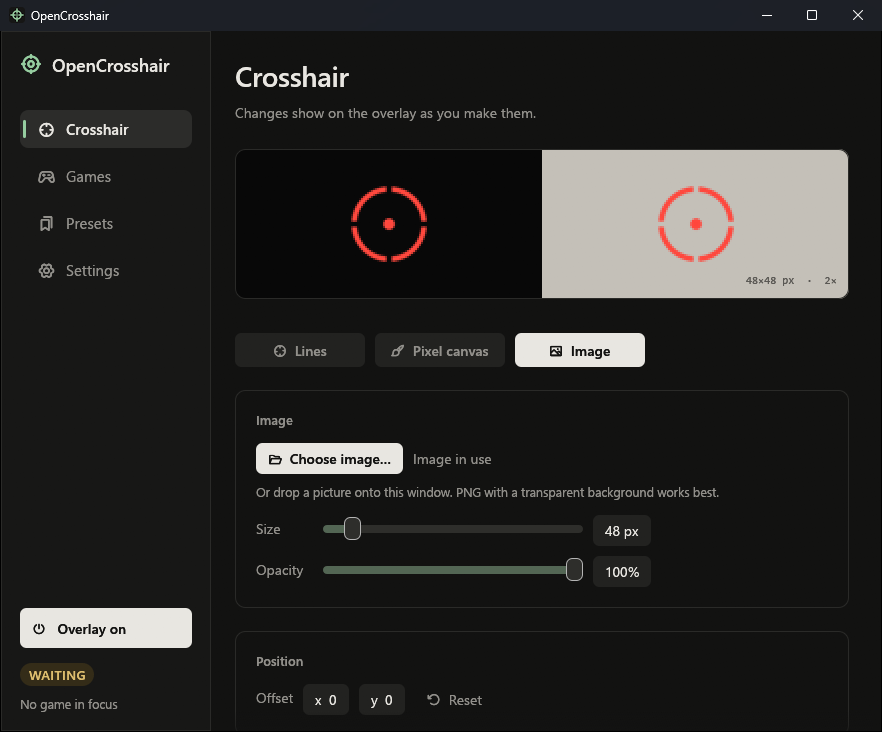
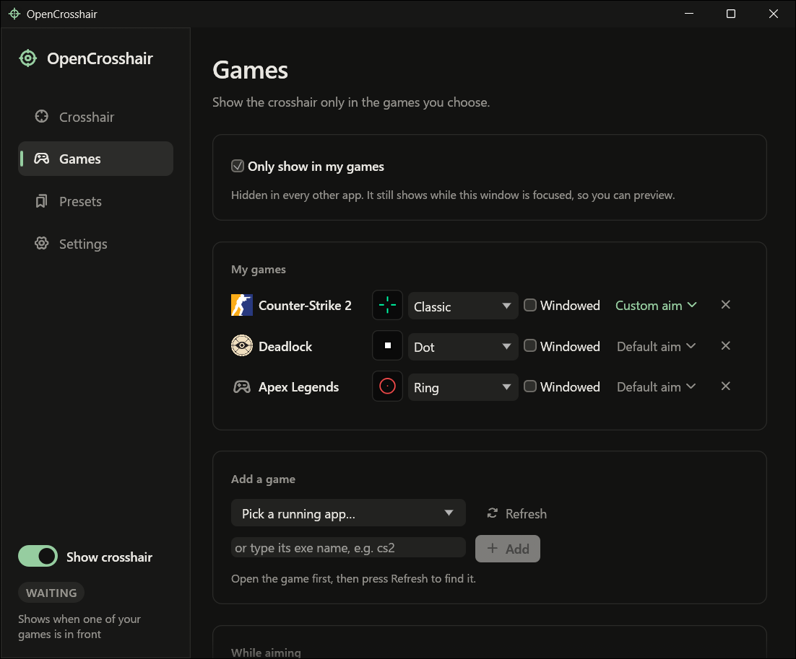
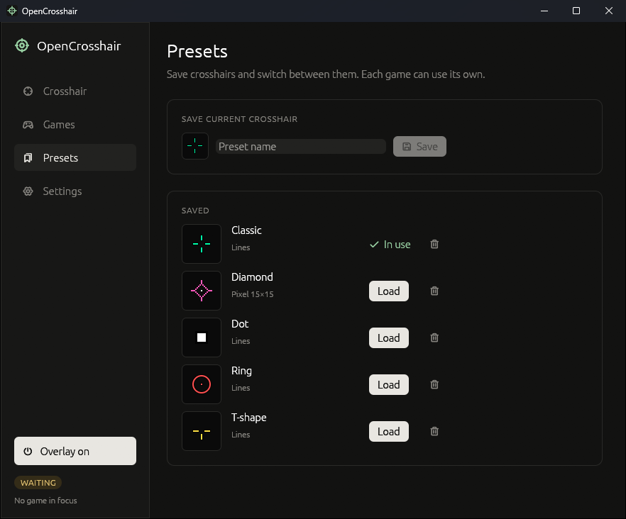
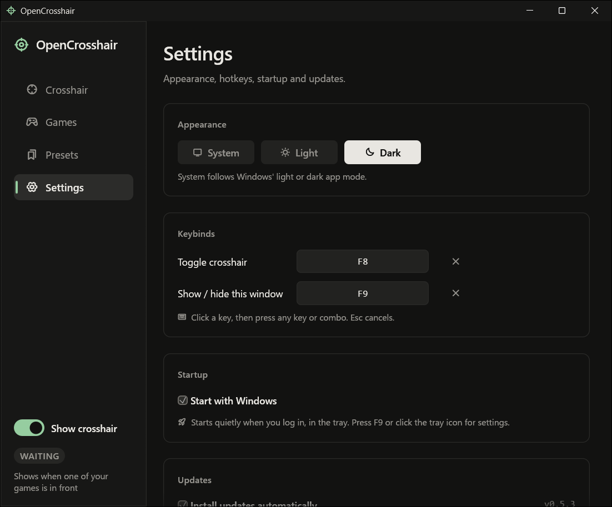
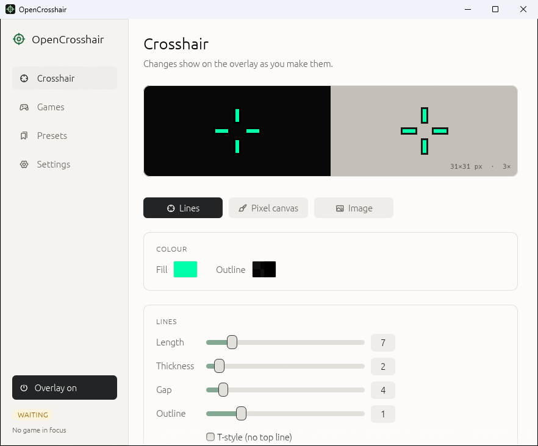
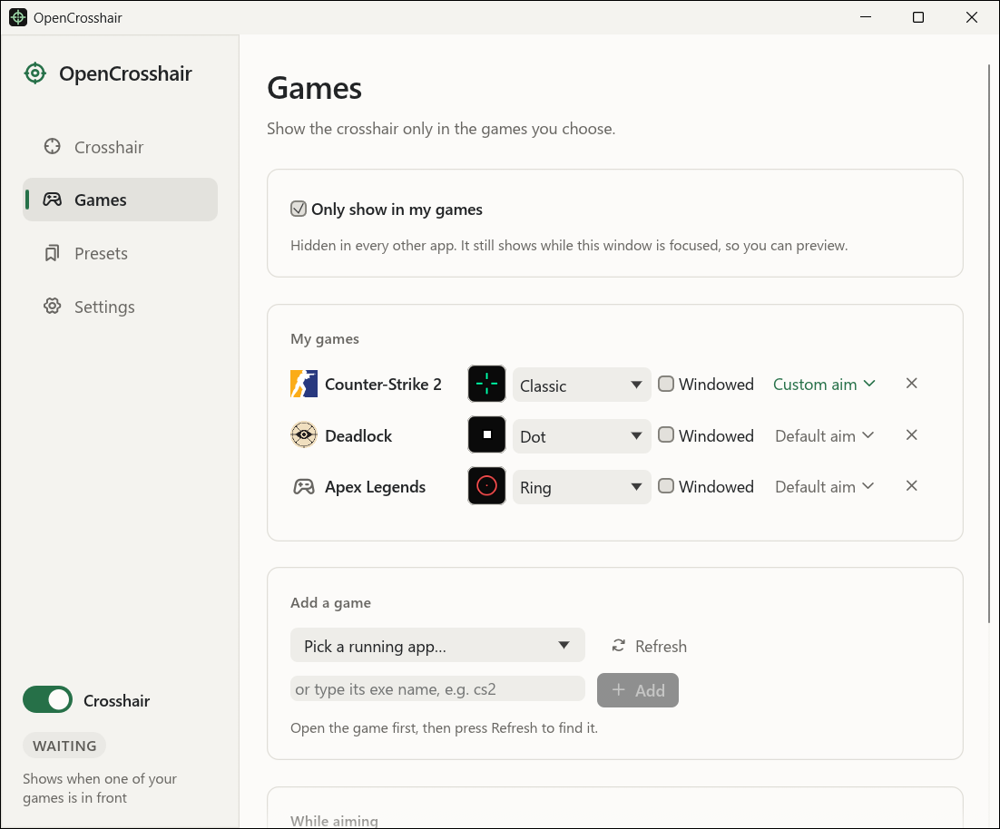
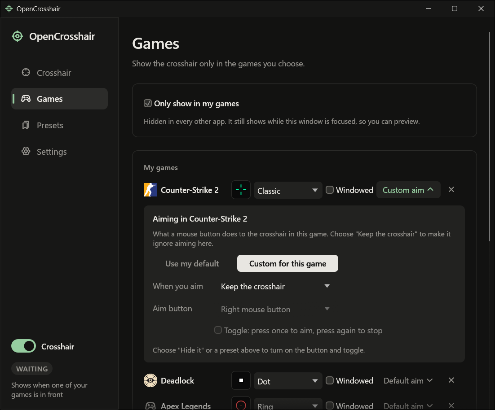

# OpenCrosshair

A crosshair overlay for Windows games. Free, open source, and small: a single 7 MB exe written in
Rust that uses just a few MB of RAM while it sits in the tray.



It draws your crosshair in a transparent, click-through window on top of the game. It never touches
the game itself: no DLL injection, no hooks, no reading game memory. Still, check your game's rules
before using any overlay in competitive play.

## Features

- **Line crosshairs** with length, thickness, gap, outline, T-style, centre dot and circle.
- **Pixel canvas** up to 64×64 for anything the sliders can't do, with mirrored painting and undo.
- **Your own images**: pick a picture or drop one on the window (PNG, JPEG, BMP, GIF, ICO, TIFF, WebP),
  then set its size and opacity. It's copied into the app's folder, so moving the original doesn't break it.
- **Presets**, and a different preset for each game. Export them to a `.opencrosshair` file (pictures
  included) to share or back up, and import files from others.
- **While aiming**: hide the crosshair or switch to another preset while you hold (or toggle) a mouse
  button, for games with aim down sights. Set a default, then give any game its own rule, or tell it
  to ignore aiming altogether (so right-click can do nothing in one game and something in another).
- **Games only mode**: the crosshair shows while one of your games is focused and hides everywhere else.
  Games are listed by their real name and icon, read from the game's own exe.
- **Light and dark themes**. It follows Windows' app mode, or you can pick one in Settings.
- **Keyboard and screen reader friendly**: every control can be reached with Tab, and the window is
  exposed to Windows UI Automation, which is what screen readers such as Narrator and NVDA read.
- **Lives in the tray**, out of your way and out of Alt+Tab. Click the icon for the settings.
- **Rebindable global hotkeys**: F8 toggles the crosshair, F9 opens the settings.
- **Start with Windows**, straight to the tray.
- **Automatic updates** from GitHub releases. It waits until you've left your game before restarting.
- Stays in the middle of the screen. If a game runs on your second monitor it follows the game there,
  and games you play in a window can be set to centre on that window instead.



| Image | Games | Presets | Settings |
| --- | --- | --- | --- |
|  |  |  |  |

The same pages in the light theme:

| Crosshair | Games |
| --- | --- |
|  |  |

Each game can follow your default aiming rule or have its own. Here Counter-Strike 2 is set to keep the
crosshair as it is, so the mouse button does nothing there, while other games still switch or hide it:



## How it compares

There are good crosshair overlays already. Here's how OpenCrosshair lines up against the popular ones,
going by each project's own store page or README in October 2026. A dash means the page doesn't say.

| | OpenCrosshair | [Crosshair X] | [HudSight] | [Simple Sight] | [CrossOver] | [simple-crosshair-overlay] |
| --- | --- | --- | --- | --- | --- | --- |
| Price | Free | Paid | Paid | Free | Free | Free |
| Source code | Open (MIT) | Not published | Not published | Not published | Source-available (FSL-1.1-MIT) | Open (GPL-3.0) |
| Built with | Rust, native Win32 | – | – | Electron | Electron | Rust |
| Exclusive fullscreen | No (see below) | Yes, through Xbox Game Bar | Yes, through hooks or Game Bar | Yes, through a Game Bar extension | No | No |
| Designer | Lines, 64×64 pixel canvas | Yes, with animations | Generator and image editor | Cross, circle, pixels | 530+ built-in | Built-in, scalable |
| Import images | Yes | Yes | Yes | Yes | Yes | Yes |
| Crosshair per game | Yes, automatic | Yes | – | Yes | – | – |
| Hide or swap when aiming | Yes | Yes | – | Yes | Yes | – |
| Community library | No | Steam Workshop | Steam Workshop | Steam Workshop | – | – |
| Platforms | Windows | Windows | Windows | Windows | Windows, macOS, Linux | Windows |

**Where OpenCrosshair is different**

- **It's light.** One 7 MB exe with no browser engine inside. Simple Sight's install folder, for
  comparison, is 525 MB; it and CrossOver are built on Electron, which bundles a copy of Chromium.
  OpenCrosshair idles at a few MB of RAM in the tray and uses no measurable CPU while you play.
- **It's yours to change.** MIT licensed, so you can fork it, ship it, or build it into something else.
- **It figures out the game for you.** It notices which game is in front, switches to that game's
  preset and hides itself everywhere else, with no profiles to switch by hand.
- **Nothing to break with game updates.** It doesn't hook into games or rely on Game Bar, so a game
  patch or a Windows update has nothing to break.

**What it doesn't do (yet)**

- **True exclusive fullscreen.** Nothing can draw over it without hooking into the game or going through
  Xbox Game Bar, and Game Bar widgets have to be written in C# or C++ and published through the
  Microsoft Store. Most games don't need it, though: see [Fullscreen](#fullscreen) below.
- A shared library of crosshairs from other players.
- macOS and Linux.

[Crosshair X]: https://store.steampowered.com/app/1366800
[HudSight]: https://store.steampowered.com/app/1477830
[Simple Sight]: https://store.steampowered.com/app/3256420
[CrossOver]: https://github.com/lacymorrow/crossover
[simple-crosshair-overlay]: https://github.com/zkxs/simple-crosshair-overlay

## Install

Download `OpenCrosshair-Setup.exe` from the [latest release](https://github.com/Tu2525/OpenCrosshair/releases/latest)
and run it. It installs for your user account only, so it doesn't need admin rights, and you can remove it
from Apps & features like anything else.

If you'd rather not install anything, download `OpenCrosshair.exe` instead and run it from wherever you like.

The exe isn't code-signed yet, so Windows SmartScreen may warn you the first time. Click
**More info**, then **Run anyway**.

## Fullscreen

OpenCrosshair draws a window on top of the game, so the game has to let other windows sit above it.

- **Borderless and windowed** always work.
- **"Fullscreen" in most modern games** works too. Since Windows 10, DirectX 11 and 12 games that ask for
  fullscreen usually get Windows' *fullscreen optimizations*, which behave like borderless underneath.
- **True exclusive fullscreen** takes over the display, and nothing can draw above it without hooking
  into the game, which this deliberately doesn't do. That happens when *Disable fullscreen
  optimizations* is ticked for the game's exe, and some older games can still end up there.

OpenCrosshair checks the second case for you. If one of your games has that box ticked, the Games page
says so and has a **Turn them back on** button. That only changes your own account, needs no admin
rights, and leaves any other compatibility settings on the exe alone. The sidebar also shows
**Fullscreen** while Windows reports a game running Direct3D fullscreen, as a hint to check this if you
can't see the crosshair.

If a game still hides it, use borderless mode.

## Using it

- **F8** shows or hides the crosshair, **F9** shows or hides the settings window. Both can be changed under Settings.
- Click the tray icon for the settings; right-click it to toggle the crosshair or quit. On Windows 11 a new
  tray icon starts out behind the **^** arrow, and you can drag it onto the taskbar.
- Closing the settings window hides it to the tray; the crosshair keeps running.
- Launching OpenCrosshair while it's already running just brings up the settings.
- Settings are saved as you change them, to `%APPDATA%\OpenCrosshair\settings.json`.

## How it works

The overlay is a layered window (`WS_EX_LAYERED | WS_EX_TRANSPARENT`) drawn with `UpdateLayeredWindow`.
It's redrawn only when the crosshair actually changes, so while you play it uses no measurable CPU.

Focus changes come from an out-of-context `SetWinEventHook`, so there's no polling and nothing is loaded
into other processes. When the focused app is one of your games, the crosshair moves to the middle of
the monitor that game is on, or to the middle of the game's window for games marked as windowed.

"While aiming" only checks the mouse button (about 60 times a second, with `GetAsyncKeyState`) while one
of your games is in front and that game's rule (its own, or the default) has an action set. It reads the
button's state; it never installs an input hook.

Pictures are decoded by the Windows Imaging Component that ships with Windows, so there's no image
library in the exe either.

The settings window uses [egui](https://github.com/emilk/egui). With it open the app uses about 28 MB,
mostly the window's OpenGL context and fonts. When it's hidden those pages sit untouched, so the app
hands them back to Windows and drops to a few MB or less until you open the window again.

The interface is set in Windows' own Segoe UI and Consolas, read from the Windows fonts folder, so no
font is bundled (egui's built-in fonts take over if those files are missing). Screen reader support
comes from egui's AccessKit integration: it adds about 0.3 MB to the exe and costs nothing while idle.
Colours are two palettes, light and dark, and their text colours are checked against WCAG contrast
(4.5:1 for text, 3:1 for control outlines).

Game names come from each exe's version info (what Task Manager shows), then its window title, and the
icons come straight from the exe through the Shell API. The app icon is drawn from code in `build.rs` at
compile time, so there's no icon file to keep in sync.

Updates go through WinHTTP, which is part of Windows, so no TLS library ships with the app. A running exe
can't be overwritten, but it can be renamed: the updater downloads the new build, checks it arrived
complete, swaps the two files and restarts.

`OpenCrosshair-Setup.exe` is the same binary as `OpenCrosshair.exe`. When its file name contains "setup",
it installs itself instead of starting up.

| File | What's in it |
| --- | --- |
| `src/render.rs` | Turns crosshair settings into pixels |
| `src/overlay.rs` | The overlay window, tray icon, hotkeys, focus and aiming |
| `src/ui.rs` | Settings window |
| `src/apps.rs` | Which app is in front, its name and icon, its fullscreen setting |
| `src/picture.rs` | Loading images, and the file picker |
| `src/config.rs` | Settings and presets, saved as JSON |
| `src/update.rs` | Self-updater |
| `src/install.rs` | Installer, uninstaller, start with Windows, single instance |

## Building

You need Rust (stable) and the Windows SDK, which comes with the Visual Studio Build Tools.

```
cargo build --release
```

The exe ends up in `target/release/OpenCrosshair.exe`. Copy it to a name containing `setup` if you want the installer.

## Releasing

Bump `version` in `Cargo.toml`, commit, then tag and push:

```
git tag v0.4.1
git push origin v0.4.1
```

GitHub Actions builds the release and attaches both exes. Installed copies check every six hours and update themselves.

## License

MIT. See [LICENSE](LICENSE).
